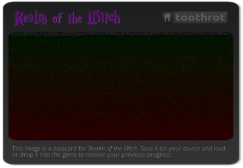

# png-cartridge

This is a tiny JavaScript library that enables you to use PNG images as virtual
cartridges to store data.

## Installation

    npm install --save png-cartridge

## Example cartridges

These images contain the source code of the library:

Just plain data, without using a source image:


With a source image:




## Usage

Creating a cartridge:

```js
var cartridge = require("png-cartridge");

//
// The `save` function creates an Image instance with a data URI as its `src`.
//
var image = cartridge.save({
    foo: "bar"
});

document.body.appendChild(image);
```

You can also use a source image to beautify the resulting image:

```js
var template = document.querySelector(".source-image");
var image = cartridge.save(data, template);
```

Loading data from an image works like this:

```js
var source = document.querySelector(".cartridge-image");
var data = cartridge.load(source);

console.log(data);
```

## How it works

Data is stored in the red, green and blue channels of each pixel with an alpha value
of `255`. You can either create an ugly data-only image from scratch or supply
your own source image.

Supplying your own source image is useful if you need something pretty. Just make sure
that all the pixels of your image that shouldn't be used as data have an alpha value
of `254` or less. The data appears in the resulting images as dark noise.

Data to be stored in a PNG cartridge is stringified to JSON, compressed using zlib (pako) and
then saved as base64 data. Each data pixel stores 3 base64 characters.

## Limitations

This only works in the browser right now because it uses the HTML5 canvas to manipulate images.
